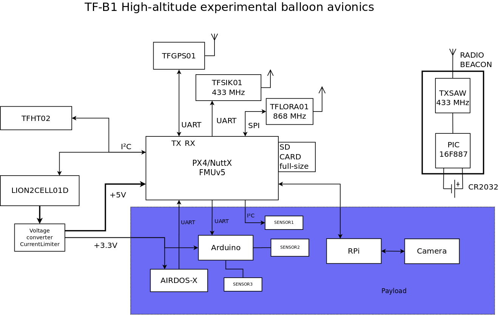

# TF-B1
high-altitude balloon experimental platform

### Design features 

  * Redundant telemetry link 
  * Gondola orientation tracking and logging 
  * Realiable IMU sensor processing and caliblation
  * Possible of use relative high-power payloads
  * Pre-flight continuous charging possible
  * Power monitoring and maximal uptime calculation relevant to actual temperature

### Reference implementations 

  * [FIK-6 high-altitude-balloon flight](https://github.com/ODZ-UJF-AV-CR/FIK-6)
  * [FIK-5 experiment](https://github.com/ODZ-UJF-AV-CR/FIK-5)

